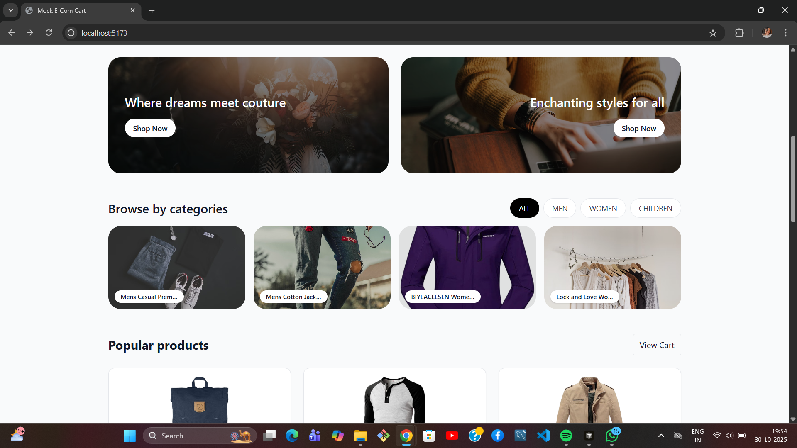
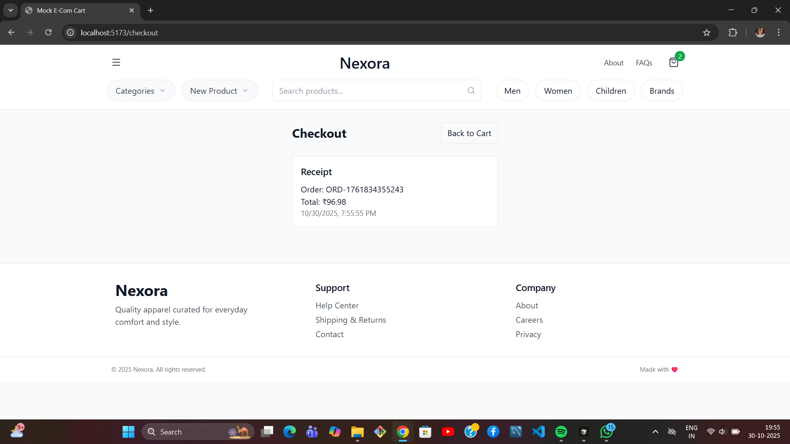

#  Mock E‑Com Cart (Nexora)

Full‑stack mock shopping cart built with React + TypeScript (frontend) and Node + Express + TypeScript (backend). Products are fetched from Fake Store API via the backend. Cart and checkout are mock flows.

##  Overview

- **Frontend:** React + Vite + TypeScript + Tailwind CSS
- **Backend:** Node.js + Express + TypeScript
- **Database:** None (in‑memory cart)
- **API:** `https://fakestoreapi.com`

##  Monorepo Structure

```txt
/
├─ backend/   # Express + TypeScript API (Fake Store proxy)
├─ frontend/  # React + Vite + TypeScript client
└─ README.md
```

##  Setup & Run Locally

### 1) Clone
```bash
git clone https://github.com/<your-username>/nexora-cart.git
cd nexora-cart
```

### 2) Backend
```bash
cd backend
npm install
npm run dev
# http://localhost:4000
```

### 3) Frontend
```bash
cd ../frontend
npm install
npm run dev
# http://localhost:5173
```

###  Environment Variables
```bash
# frontend/.env
VITE_API_BASE=http://localhost:4000
```
```bash
# backend/.env (optional)
PORT=4000
FAKE_STORE_URL=https://fakestoreapi.com
```

##  API Endpoints

| Method | Endpoint               | Description                                                   |
|--------|------------------------|---------------------------------------------------------------|
| GET    | /api/products?limit=20 | List products                                                 |
| GET    | /api/cart              | Get current cart                                              |
| POST   | /api/cart              | Add item `{ productId, qty }`                                 |
| DELETE | /api/cart/:id          | Remove item                                                   |
| POST   | /api/checkout          | Mock checkout → `{ orderId, total, timestamp }`               |

Notes:
- Backend proxies Fake Store and caches product results for 5 minutes.
- Cart is stored in memory, keyed by `x-user-id` header (frontend sets a demo ID).

## Frontend Features

- Products grid with Add to Cart
- Cart page (items, remove, total)
- Checkout form → mock receipt
- Search (`?q=`) and category filters (`?cat=men|women|children`)
- Responsive Tailwind UI: navbar, hero, promos, categories, footer

##  Screenshots

- **Hero Section**  
  

- **Home / Product Promotions**  
  

- **Product UI (Grid)**  
  

- **Cart Page**  
  

- **Checkout Page**  
  

- **Checkout Receipt**  
  

## Tech Stack

Frontend: React, Vite, TypeScript, Tailwind CSS

Backend: Node.js, Express, TypeScript, Axios, Zod

Tooling: ESLint, Prettier, ts-node-dev

##  Scripts

```txt
Backend
- npm run dev     # ts-node-dev server
- npm run build   # compile TypeScript
- npm start       # run compiled build

Frontend
- npm run dev     # Vite dev server
- npm run build   # production build
- npm run preview # preview production build
```

## Demo

Unlisted video (1–2 minutes): https://www.loom.com/share/<your-demo-id>

Shows: load products → add/remove → cart total → checkout receipt.

##  Notes & Highlights

- Backend normalizes product fields and handles API proxying/caching.
- In‑memory cart keeps the demo simple (no DB required).
- Full TypeScript across frontend and backend.

##  License

MIT

# nexora-_assignment
